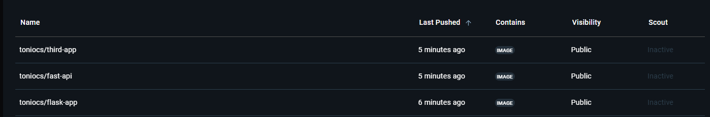

# E5-SDWAN
MOAD Djamel rendu


<!-- PROJECT LOGO --> <br /> <h3 align="center">Projet Kubernetes : Applications Python</h3> 


<!-- ABOUT THE PROJECT -->
## Struture du projet

Voici la structure du projet:


. Contenu du Manifest de production


``` yml
# Namespace pour préproduction
apiVersion: v1
kind: Namespace
metadata:
  name: prod  # Nom du namespace.
---
# Déploiement pour Flask
apiVersion: apps/v1  # Version de l'API Kubernetes utilisée pour définir un déploiement.
kind: Deployment  # Décrit un objet de type Déploiement, utilisé pour gérer l'état d'une application.
metadata:
  name: flask-app  # Nom unique de ce déploiement, identifiant dans le cluster Kubernetes.
spec:
  selector:
    matchLabels:
      app: flask-app  # Sélectionne les pods ayant le label "app: flask-app".
  template:
    metadata:
      labels:
        app: flask-app  # Labels attribués aux pods créés par ce déploiement.
    spec:
      containers:
      - name: flask-container  # Nom du conteneur pour identifier dans les logs ou métriques.
        image: toniocs/flask-app:prod  # Image Docker utilisée pour le conteneur (version de production).
        imagePullPolicy: Never  # Indique que l'image ne sera pas téléchargée depuis un registre.
        ports:
        - containerPort: 5000  # Port exposé par le conteneur (Flask écoute généralement sur ce port).
---
# Service pour Flask (NodePort)
apiVersion: v1  # Version de l'API pour les services Kubernetes.
kind: Service  # Objet Service pour exposer une application vers l'extérieur.
metadata:
  name: flask-service  # Nom unique pour identifier ce service.
spec:
  type: NodePort  # Type de service permettant un accès depuis un port du nœud.
  selector:
    app: flask-app  # Sélectionne les pods correspondants au déploiement Flask.
  ports:
  - name: http  # Nom logique pour identifier ce port.
    protocol: TCP  # Protocole utilisé.
    port: 80  # Port sur lequel le service sera accessible.
    targetPort: 5000  # Port cible exposé par le conteneur.
    nodePort: 30006  # Port statique utilisé sur le nœud Kubernetes.
  - name: https
    protocol: TCP
    port: 443  # Port sécurisé pour HTTPS.
    targetPort: 8080  # Peut être utilisé pour une future configuration sécurisée.
    nodePort: 30007  # Port statique supplémentaire pour HTTPS.
---
# Déploiement pour FastAPI
apiVersion: apps/v1
kind: Deployment
metadata:
  name: fastapi-app  # Nom du déploiement pour l'application FastAPI.
spec:
  selector:
    matchLabels:
      app: fastapi-app
  template:
    metadata:
      labels:
        app: fastapi-app
    spec:
      containers:
      - name: fastapi-container  # Nom du conteneur pour FastAPI.
        image: toniocs/fast-api:prod  # Image Docker contenant l'application FastAPI.
        imagePullPolicy: Never
        ports:
        - containerPort: 8000  # FastAPI écoute habituellement sur ce port.
---
# Service pour FastAPI (LoadBalancer)
apiVersion: v1
kind: Service
metadata:
  name: fastapi-service
spec:
  type: LoadBalancer  # Service accessible via une IP publique attribuée par le cloud provider.
  selector:
    app: fastapi-app
  ports:
  - name: http
    protocol: TCP
    port: 80
    targetPort: 8000  # Route les requêtes HTTP vers le port de FastAPI.
  - name: https
    protocol: TCP
    port: 443
    targetPort: 8000
---
# Déploiement pour Third-App
apiVersion: apps/v1
kind: Deployment
metadata:
  name: third-app  # Déploiement pour une troisième application (Third-App).
spec:
  selector:
    matchLabels:
      app: third-app
  template:
    metadata:
      labels:
        app: third-app
    spec:
      containers:
      - name: third-app-container  # Conteneur pour Third-App.
        image: toniocs/third-app:prod
        imagePullPolicy: Never
        ports:
        - containerPort: 8080  # Port habituellement utilisé pour une application web.
---
# Service pour Third-App (NodePort)
apiVersion: v1
kind: Service
metadata:
  name: third-app-service
spec:
  type: NodePort
  selector:
    app: third-app
  ports:
  - name: http
    protocol: TCP
    port: 80
    targetPort: 8080
    nodePort: 30008  # Port NodePort exposé pour HTTP.
  - name: https
    protocol: TCP
    port: 443
    targetPort: 8080
    nodePort: 30009  # Port NodePort exposé pour HTTPS.

```

. Contenu du Manifest de préproduction

``` yml
# Namespace pour préproduction
apiVersion: v1
kind: Namespace
metadata:
  name: preprod  # Nom du namespace.
---
# Déploiement pour Flask
apiVersion: apps/v1  # Version de l'API Kubernetes utilisée pour définir un déploiement.
kind: Deployment  # Gère la création et la résilience des pods, garantit le bon nombre de répliques, et permet des mises à jour progressives (rolling updates) pour éviter les interruptions
metadata:
  name: flask-app  # Nom unique de ce déploiement, permettant son identification dans Kubernetes.
spec:
  selector:
    matchLabels:
      app: flask-app  # Sélectionne les pods ayant ce label pour gérer leur état.
  template:
    metadata:
      labels:
        app: flask-app  # Labels attribués aux pods créés par ce déploiement.
    spec:
      containers:
      - name: flask-container  # Nom donné au conteneur dans les pods.
        image: toniocs/flask-app:preprod  # Image Docker utilisée, version préproduction.
        imagePullPolicy: Never  # Indique que l'image doit être déjà disponible localement.
        ports:
        - containerPort: 5000  # Port exposé par le conteneur Flask.
---
# Service pour Flask (NodePort)
apiVersion: v1  # Version de l'API Kubernetes pour les services.
kind: Service  # Permet de regrouper et d'exposer des pods à travers une adresse stable, indépendamment de leur cycle de vie. Simplifie la communication entre applications ou avec des utilisateurs externes.
metadata:
  name: flask-service  # Nom unique pour identifier ce service.
spec:
  type: NodePort  # Permet l'accès externe via un port spécifique du nœud Kubernetes.
  selector:
    app: flask-app  # Lien avec les pods ayant le label "app: flask-app".
  ports:
  - name: http  # Nom logique pour identifier ce port.
    protocol: TCP  # Protocole utilisé pour la communication réseau.
    port: 80  # Port sur lequel le service écoute.
    targetPort: 5000  # Redirection vers le port du conteneur.
    nodePort: 30001  # Port accessible à l'extérieur du cluster pour HTTP.
  - name: https
    protocol: TCP
    port: 443  # Port sécurisé pour HTTPS.
    targetPort: 8080  # Redirection vers un port différent pour la communication sécurisée.
    nodePort: 30004  # Port accessible à l'extérieur pour HTTPS.
---
# Déploiement pour FastAPI
apiVersion: apps/v1
kind: Deployment
metadata:
  name: fastapi-app  # Nom de l'application FastAPI pour ce déploiement.
spec:
  selector:
    matchLabels:
      app: fastapi-app
  template:
    metadata:
      labels:
        app: fastapi-app
    spec:
      containers:
      - name: fastapi-container  # Nom donné au conteneur FastAPI.
        image: toniocs/fast-api:preprod  # Image Docker, version préproduction.
        imagePullPolicy: Never
        ports:
        - containerPort: 8000  # Port sur lequel FastAPI écoute.
---
# Service pour FastAPI (LoadBalancer)
apiVersion: v1
kind: Service
metadata:
  name: fastapi-service  # Nom du service associé à l'application FastAPI.
spec:
  type: LoadBalancer  # Fournit une adresse IP publique pour accéder à l'application.
  selector:
    app: fastapi-app
  ports:
  - name: http
    protocol: TCP
    port: 80  # Port d'écoute pour HTTP.
    targetPort: 8000  # Redirection vers le port exposé par le conteneur.
  - name: https
    protocol: TCP
    port: 443  # Port d'écoute pour HTTPS.
    targetPort: 8000  # Redirection également vers FastAPI pour HTTPS.
---
# Déploiement pour Third-App
apiVersion: apps/v1
kind: Deployment
metadata:
  name: third-app  # Nom de l'application Third-App pour ce déploiement.
spec:
  selector:
    matchLabels:
      app: third-app
  template:
    metadata:
      labels:
        app: third-app
    spec:
      containers:
      - name: third-app-container  # Nom donné au conteneur Third-App.
        image: toniocs/third-app:preprod  # Image Docker, version préproduction.
        imagePullPolicy: Never
        ports:
        - containerPort: 8080  # Port exposé par le conteneur Third-App.
---
# Service pour Third-App (NodePort)
apiVersion: v1
kind: Service
metadata:
  name: third-app-service  # Nom du service lié à Third-App.
spec:
  type: NodePort  # Expose le service sur un port spécifique des nœuds du cluster, permettant un accès externe direct. Utile en préprod pour tester la connectivité sans configuration avancée comme un LoadBalancer ou Ingress.
  selector:
    app: third-app
  ports:
  - name: http
    protocol: TCP
    port: 80  # Port d'écoute pour HTTP.
    targetPort: 8080  # Redirection vers le conteneur.
    nodePort: 30002  # Port NodePort exposé pour HTTP.
  - name: https
    protocol: TCP
    port: 443  # Port d'écoute pour HTTPS.
    targetPort: 8080  # Redirection vers le conteneur pour HTTPS.
    nodePort: 30003  # Port NodePort exposé pour HTTPS.

```


<!-- GETTING STARTED -->

### Pour déployer les applications:

1- Exécuter la commande suivante pour mettre en place vos application avec le manifest:

``` bash
k apply -f "nom du fichier.yaml" -n "nom du namespace"
```

2- AEt vous pouvez voir vos application déployer en faisant:

``` bash
k get all
```


. Docker Hub repositories



<p align="right">(<a href="#readme-top">back to top</a>)</p>
